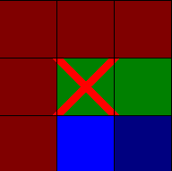
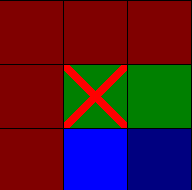

# Implementace A*
### Autor: Michal Kubečka (241449)
---
Skript hledá optimální cestu v grafu (na mapě) za pomoci algoritmu A*.

Skript lze aplikovat na vlastní mapu za pomoci vhodného nastavení argumentů při spuštění.
## Argumenty příkazové řádky:
* `--help`                      Výpis nápovědy
* `--squareSize=value[px]`      Velikost čtverečků
* `--map=path/fileName.csv`     Cesta k souboru s mapou
* `--start=X,Y`                 Počáteční souřadnice
* `--goal=X,Y`                  Cílové souřadnice
* `--delay=time[ms]`            Prodleva ve vykreslování mezi jednotlivými kroky A*

Pokud není argument nastaven, je použita jeho výchozí hodnota.
* Je zapotřebí počítat se situací, že pro námi zvolenou mapu nemusí být počáteční či cílové souřadnice korektní - je tedy vhodné, při uvádění vlastní mapy, uvést i počátek a konec cesty.

Příklad korektního nastavení argumentů:
```
python3 ./astar.py --map=maps/map1.csv --start=6,7 --goal=3,3 --squareSize=64 --delay=25
```
Pro Windows je zapotřebí nahradit `/` za `\` u cest k souborům:
```
python .\astar.py --map=maps\map1.csv ...
```
## Implementace řešení
Skript nabývá dvou základních stavů - hledání cesty a vykreslení nalezené cesty.
1. Hledání cesty:
    * Cesta je hledána iterativně. V každé iteraci dochází k vykreslení aktuálního stavu výpočtu a k vyvolání metody `nextStep()` třídy `Astar`. Tato metoda vyhledá prvek fronty `open` s nejnižší hodnotou atributu `f` a přesune jej do fronty `closed`. Zároveň také zpracuje jeho čtyřokolí a nově vygenerované prvky přidá do fronty `open`.
    * Pro každou iteraci je obsah okna obnoven a změna je vykreslena.
2. Vykreslení nalezené cesty:
    * Za předpokladu, že byla nalezena, vykreslí se cesta zelenou barvou a okno s vizualizací se už nemění.

## Vizualizace
Typy polí jsou rozlišeny za pomoci barev:
* Bílá - volné pole
* Tmavě červená - zeď
* Světle modrá - prvek fronty open
* Tmavě modrá - prvek fronty closed
* Tmavě zelená - prvek je součástí nalezené optimální cesty
* Červené X - značí cílové pole

## Zajímavé funkce
1. Metoda `findPath()` třídy `Astar`:
    * Metoda hledá optimální cestu ve frontě `closed`, přes kterou iteruje pozpátku.
2. Funkce `drawGoal()`:
    * Funkce vykresluje "křížek" na cílové pole. Jelikož skript podporuje změnu velikosti pole, měly by se měnit i tloušťky čar "křížku" k zachování jeho proporcí. Při využití argumentu `width` funkce `pygame.draw.line()` však konce čar přesahují do okolních polí. Protože se nenabízí jednoduché řešení vykreslením "vrstev" okna v jiném pořadí, aby došlo k překreslení přesahujících rohů, je problém vyřešen vykreslováním rovnoběžných čar přesně vedle sebe, kdy každá čára je na svých koncích zkrácena právě o tolik pixelů, o kolik je vzdálena od středové přímky.





Využití argumentu width (vlevo), vlastní implementace (vpravo)

## Známá omezení
1. Za situace, kdy nelze vytvořit cestu mezi počátkem a cílem (odděleno zdí), se skript při vyčerpání všech možností sám ukončí a tedy nepokračuje nadále ve vykreslování okna s řešením.

## Závislosti
Skript využívá moduly `csv`, `sys`, `re`, `math` a herní engine `pygame` pro vykreslení průběhu implementovaného algoritmu A*. Skript byl vyvíjen na verzi Python3.10.6 na os Linux. Funkčnost byla také otestována na MS Windows na verzi Python3.10.10.